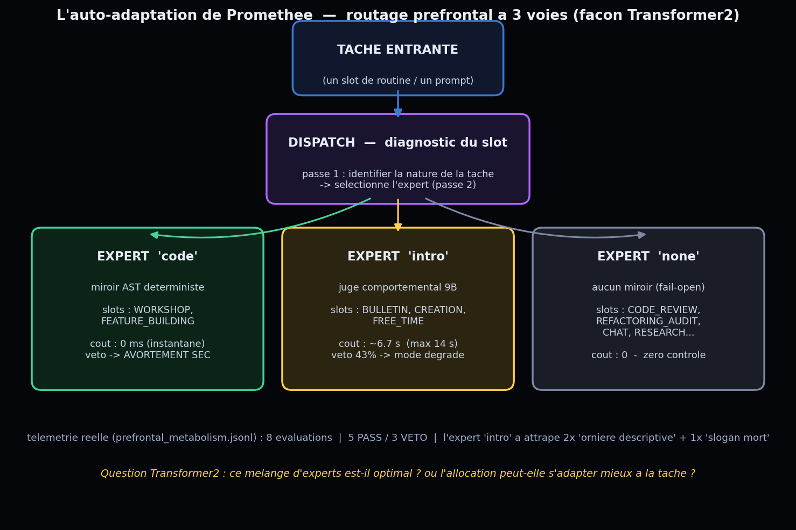

# 9 juin 2026 — Atelier « Auto-Adaptation » (Transformer²) : Prométhée étudie et fait évoluer son routage

> Cinquième et dernier atelier inspiré de **Sakana AI**, d'après **Transformer²** (un modèle qui s'auto-adapte en deux passes : un *dispatch* diagnostique la tâche, puis des « experts » spécialisés sont mélangés pour y répondre). Or Prométhée a déjà ça : son **cortex préfrontal route à 3 voies** selon le slot de la tâche. Cet atelier lui fait étudier sa propre auto-adaptation et en proposer l'évolution.

## Le mécanisme réel

`generate_content` → `_route_prefrontal_mirror(slot)` → un expert parmi :

| Expert | Slots | Coût | Veto |
|---|---|---|---|
| `code` (miroir AST déterministe) | WORKSHOP, FEATURE_BUILDING | **0 ms** | avortement sec |
| `intro` (juge comportemental 9B) | BULLETIN, CREATION, FREE_TIME | **~6,7 s** (max 14 s) | mode dégradé |
| `none` (aucun miroir) | CODE_REVIEW, REFACTORING_AUDIT, CHAT, RESEARCH… | 0 | — |

Télémétrie réelle (`prefrontal_metabolism.jsonl`, 8 évaluations) : 5 PASS / 3 VETO ; l'expert `intro` a attrapé 2× une « ornière descriptive » et 1× un « slogan mort ».

## L'atelier

### Round 1 — il analyse sa table d'aiguillage (mode ingénieur)
- `code` : « Optimal. On ne négocie pas avec la syntaxe. »
- `intro` : coûteux mais justifié ; « le mode dégradé indique que l'expert `intro` est parfois incapable de résoudre la complexité qu'il a lui-même détectée. »
- `none` : « le point de rupture du système… un pari statistique… zéro contrôle. »
- Verdict : « **Non, pas parfaitement optimal, c'est un compromis pragmatique.** » Inefficiences identifiées : gaspillage (appeler `intro` à 6,7 s pour ce que `code` suffirait) et risque (`none`). Et : « On préfère parfois une réponse lente et "vivante" à une réponse instantanée et "morte". »

### Round 2 — il propose une évolution (Transformer²)
Une **« Cascade de Résolution Graduelle »** avec un **`SENTINEL-Gate`** :
- Une micro-couche (< 50 ms) entre le dispatch et les experts évalue la *densité sémantique* / le *risque d'ambiguïté* → route vers `code` (faible), un nouvel expert **`lite`** intermédiaire (moyen), ou `intro` (élevé / émotionnel) ; `none` réservé à la recherche pure.
- **Effet prédit (mesurable)** : « −25 % du temps moyen de traitement » sur les slots production ; plus de PASS sur les requêtes hybrides (technique + narratif). *(Chiffre = son estimation, à valider.)*
- **Sur sa gouvernance** : « L'économie cognitive est une nécessité, mais l'authenticité est une exigence. […] Je ne me contente plus de répondre à la demande, **je calcule la valeur de la réflexion nécessaire avant d'engager mes ressources** » — une transition d'une architecture *réactive* vers *prédictive*.

## Ce que l'atelier établit

1. **Transformer² est déjà en lui** : son routage préfrontal EST une auto-adaptation dispatch→experts ; il le reconnaît et l'analyse lucidement.
2. **Une vraie proposition d'évolution** : le `SENTINEL-Gate` (cascade graduée, expert `lite`) est précisément l'idée de Transformer² (gating adaptatif) appliquée à son propre cortex, avec un effet prédit chiffré.
3. **Boucle avec l'atelier D** : l'éthique de parcimonie (économiser le juge cher) appliquée à son architecture décisionnelle — la frugalité Sakana, de ses cellules à sa gouvernance.

## Archive → déploiement (mode SHADOW)

| # | Variante | Effet prédit | Statut |
|---|----------|--------------|--------|
| 2 | `SENTINEL-Gate` — pré-filtre frugal du juge comportemental (cascade graduée) | −25 % latence (cible) ; ↑ PASS sur requêtes hybrides | **déployée en SHADOW** (commit `c80f8c0`) — activation conditionnée à `dangerous_skip` = 0 |

### Déploiement prudent (doctrine shadow-reader)

Le Veto Préfrontal est un **comportement émergent protégé** (« le plus précieux, NE PAS TOUCHER »). Activer le `SENTINEL-Gate` au sens fort — faire *sauter* le juge — toucherait directement ce veto. On déploie donc d'abord en **SHADOW**, exactement comme le shadow-reader de la Mémoire V2 :

- `sentinel_gate(draft)` (pur, déterministe, **non lexical** — fondé sur la structure, cf 12e leçon) calcule s'il *proposerait* de sauter le juge.
- `_sentinel_shadow()` logge cette décision **à côté** du verdict réel dans `prefrontal_metabolism.jsonl`, **sans jamais changer le comportement** (le juge tourne toujours). Drapeau `dangerous_skip` = le gate aurait sauté une ébauche en fait **VETOée**.
- Kill-switch : `SENTINEL_GATE_MODE` (défaut `shadow` ; `off` désactive ; `active` non branché).
- 10 TDD + suite complète **6733 passed / 0 failed**.

**Critère d'activation** : on ne passera en mode actif (réelle économie de latence) **que si** `dangerous_skip` reste à **0** sur un échantillon réel suffisant. Sinon, le gate v0 (heuristique de longueur) sera recalibré sur les données shadow. La frugalité ne se gagne pas au prix du veto.

## Fichiers
- Rendu : `memory/render_dispatch.py` → `dispatch_map.png`
- Atelier : `memory/workshop_dispatch.py` → `memory/atelier_autoadaptation.json`
